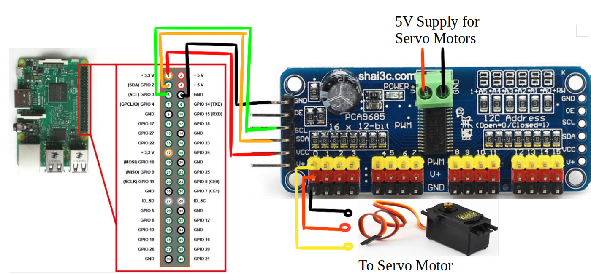
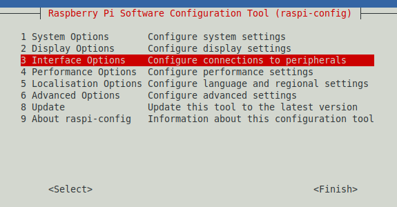

# Spiderbot

## Hardware

- [SMARS Quad](https://www.thingiverse.com/thing:2755973)
- [Raspberry Pi Zero WH 512 MB](https://www.amazon.de/gp/product/B07C7FHJDX/ref=ppx_yo_dt_b_search_asin_title?ie=UTF8&psc=1)
- [ANGEEK PCA9685](https://cdn-shop.adafruit.com/datasheets/PCA9685.pdf)
  - [Tutorial (Arduino)](https://cdn-learn.adafruit.com/downloads/pdf/16-channel-pwm-servo-driver.pdf)
  - [Circuit Python Tutorial](https://learn.adafruit.com/16-channel-pwm-servo-driver/python-circuitpython)
  - [Circuit Python](https://circuitpython.org/)
- Connection:



## Setup

### System

- Raspberry Pi Imager
  - Raspberry OS Lite (32 Bit)
  - Setup systemdaten (Name, ...)
    - WLAN setup does not seems to work this way, or just wait longer after boot ?

### WLan

- `<root>/wpa_supplicant.conf`
- Maybe `<root>/boot/wpa_supplicant.conf`, possible too.

```
trl_interface=DIR=/var/run/wpa_supplicant GROUP=netdev
country=DE
update_config=1

network={
 scan_ssid=1
 ssid="BlabuChaosCompany"
 psk="PASSWORT"
}
```

- `<root>/ssh`
-- Empty file

### Software

- `ssh frank@spiderbot`
- `sudo apt update`
- `sudo apt upgrade`
- `sudo apt-install python3-pip`

### Raspberry configuration

- `sudo raspi-config` 



- I2C on
- SSH on
- Localization 'de.DE-UTF8'
- System update

## Programming

### Circuit Python

- `sudo pip3 install adafruit-circuitpython-pca9685`
- `sudo pip3 install adafruit-circuitpython-servokit`
- [Circuit python servo programming basics](https://learn.adafruit.com/16-channel-pwm-servo-driver/python-circuitpython)

### SMARS Library

- [SMARS library](https://github.com/kevinmcaleer/smars_library)